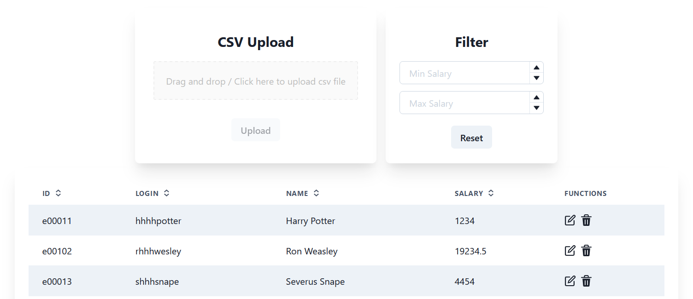

# salary-app

Submission for TAP ESTL Application 2021, due on 17th August.

## 1. Setup Instructions

### 1.1 Backend (Python/FastAPI)

#### Initialise python virtual environment

In the repository root folder, create a python venv:

`python -m venv venv`

To activate the virtual environment (Linux):

`source venv/bin/activate`

To activate the virtual environment (Windows):

`venv\Scripts\activate`

In virtual environment `(venv)`, install dependencies with:

`pip install -r requirements.txt`

#### Run python backend server

In virtual environment `(venv)`, to run python backend server:

`uvicorn sql_app.main:app --reload`

Server runs by default at http://localhost:8000

Documentation for api will also be available at http://localhost:8000/docs#/

#### Run tests

In virtual environment `(venv)`, to run tests:

`pytest`

### 1.2 Frontend (React + ChakraUI)

#### Install dependencies

In the **salary-app/frontend** folder, install dependencies (npm 6.14.14):

`npm install`

#### Run React webapp

In the **salary-app/frontend** folder, to run React webapp:

`npm start`

Server runs by default at http://localhost:3000

#### Run tests

In the **salary-app/frontend** folder, to run tests:

`npm test`

## 2. Assignment Writeup

I attempted User Story 1, 2, 3 and 5.

### 2.1 Assumptions

1. An integer >= 0 is valid for salary.
1. If there are any duplicate id or login, the csv file is rejected.

### 2.2 Feature(s) Explanation

1. Sorting by a certain field is done by clicking on the appropriate table header. The header icon will update to show the user if it is currently sorted by "asc" or "desc".
1. Live filter implementation, there is no need to click on a button to apply the filter.
1. Any change in filters/sort will reset the table to page 1 automatically for consistent UX.
1. Upload button is configured to be active only after a file is submitted to the provided dropzone.
1. Reset button simply clears all filters if any.

### 2.2 Other Notes

1. I added a "totalPages" field to the GET "users/" api endpoint (might interfere with automated testing).
1. In the event of missing fields on the UI (eg. Max Salary not specified only), the missing field(s) will be filled with a configurable default value.
1. The table is designed to be responsive by setting "overflowX" to "auto".
